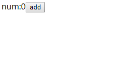
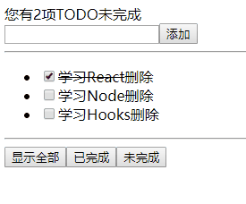

[React Hooks](https://react.docschina.org/docs/hooks-overview.html) 是React在16.8版本出的新特性。在16.8以前，React函数组件无法使用state状态、生命周期等功能，而有了Hooks，就可以使用函数式编写和类一样强大的组件。

## 类组件有什么问题？

在以前使用一个类来封装一个组件是很正常的事，但是类比函数复杂，即使是一个很简单的组件，使用“类”来编写显得很重：

```js
class Counter extends Component {
    constructor(props) {
        super(props);
        this.state = {
            num: 0
        };
    }
    addClick = (e) => {
        this.setState({ num: this.state.num + 1 }); //状态增1
    }
    render() {
        return <div>
            <label>num:{this.state.num}</label>
            <button type="button" onClick={this.addClick}>add</button>
        </div>
    }
}
```

以上是一个简单的计数器组件，每点击add按钮状态会增加1，只是这样一个简单的功能就会写很多代码，如果使用Hooks改写为函数组件：

```js
function Counter(props) {
    let [num, setNum] = useState(0);
    return <div>
        <label>num:{num}</label>
        <button type="button" onClick={() => setNum(num + 1)}>add</button>
    </div>;
}
```
可以看到功能完全一样，运行效果：



当组件越来越复杂类组件扩展功能首选是使用“高阶组件”，这是造成代码晦涩难懂的根源，每当增加一个逻辑组件都会外套一层，而Hooks会解决此类问题，让开发者从中解脱出来。

Hooks意思是钩子，React的意思是将组件的特性使用“钩子”从外界钩进来，力求达到类组件一样丰富的功能，让我们以函数式的思想来编写组件。

React提供了很多现成的HooksAPI，简单说两个一会儿用到的：

### useState

useState是React提供可以在函数组件使用状态的钩子，旧版的React中，函数组件只能开发一些显示内容的简单功能，要想使用state必须切回类组件中去。useState接收一个初始值，它返回一个数组，元素1是状态对象，2是一个更新状态的函数：

```js
let [num, setNum] = useState(0);
```
返回数组是React让我们更方便的重命名，我们直接解构即可，这样每调用`setNum(新值)`即可更新状态num，非常方便。

### useRef

React是基于组件的技术，我们在类组件中要想直接操作DOM则是通过ref引用（使用`React.createRef()`），而useRef钩子是帮助我们创建ref对象：

```js
let inputRef = useRef(null);
```
同样useRef接收一个初始值，它用来初始化对象的current属性，注意不是current.value，这样在相应的DOM元素上将对象赋给ref属性即可：

```html
<input type="text" id="name" ref={inputRef} />
```
想要取元素的内容通过value属性：

```js
console.log(inputRef.current.value); //输出文本框的值
```

下面使用Hooks结合Redux编写一个小项目

## 使用Redux+Hooks完成一个TODO实例

在以前刚刚学习Redux的时候我写了一个[TODO待办](https://juejin.im/post/5b471a5de51d4519873f2c07)的小功能，目的就是熟悉一下Redux的使用，而Hooks新特性推出了之后为了掌握Hooks与Redux，这次写一个Hooks的版本，功能与之前完全一至：

- 可以让用户添加待办事项（todo）
- 可以统计出还有多少项没有完成
- 用户可以勾选某todo置为已完成
- 可筛选查看条件（显示全部、显示已完成、显示未完成）

目录结构：

```txt
src
┗━ components 存放组件
	┗━ TodoHeader.jsx
	┗━ TodoList.jsx
	┗━ TodoFooter.jsx
┗━ store 保存redux的相关文件
	┗━ action
		┗━ types.js 定义动作类型
	┗━ reducer
		┗━ index.js 定义reducer
	┗━ index.js 默认文件用于导出store
```
组件分为3个：

- TodoHeader 用于展示未办数量
- TodoList 按条件展示待办项列表及添加待办
- TodoFooter 功能按钮（显示全部、未完成、已完成）

在从头开始时，我们先要定义好初始的状态，在reducer目录中新建index.js文件，定义好初始的state数据：

```js
let initState = {
    todos: [
        {
            id: ~~(Math.random() * 1000000),
            title: '学习React',
            isComplete: true
        },
        {
            id: ~~(Math.random() * 1000000),
            title: '学习Node',
            isComplete: false
        },
        {
            id: ~~(Math.random() * 1000000),
            title: '学习Hooks',
            isComplete: false
        }
    ]
};

function reducer(state = initState, action) {}

export default reducer;
```
以上我们手写3条来模拟初始数据，把它们存放到todos的数组中。接下来创建一个空的reducer方法传入初始数据，这样就可以基于旧的state更新出新的对象。

写好reducer方法后，我们接下来创建redux仓库，在store目录中也新建一个index.js，引入刚刚写好的reducer，即可创建出仓库对象：

```js
import { createStore } from 'redux';
import reducer from './reducer';
let store = createStore(reducer); //传入reducer
export default store; //导出仓库
```

这样准备工作已经完成。

### 统计未完成的事项

接下来完成第一个功能，统计出TODO列表中所有未完成的数量。首先，我们定义一个头组件TodoHeader.jsx：

```js
import React from 'react';

function TodoHeader(props) {

    let state = useSelector((state) => ({ todos: state.todos }));
    return <div></div>;
}

export default TodoHeader;
```
可以看到，使用Hooks我们的组件一律使用函数写法，目前此组件还没有任何功能，我们先导出它给顶层组件用于注入Redux仓库。

然后在顶层组件中使用`react-redux`库提供的Provider组件注入store：

```js
import React from 'react';
import ReactDOM from 'react-dom';
import TodoHeader from './components/TodoHeader.jsx';
import { Provider } from 'react-redux';
import store from './store';

function Index(props) {
    return <>
        <Provider store={store}>
            <TodoHeader />
        </Provider>
    </>;
}

ReactDOM.render(<Index />, document.querySelector('#root'));
```
可以看到，此时此刻和类组件的开发方式没有任何区别，接下来的工作就是要在TodoHeader.jsx组件拿到仓库数据，来编写统计功能。

在使用Hooks开发时，关联Redux仓库不再使用connect高阶函数来实现，`react-redux`包为我们提供了一个自定义钩子：`useSelector`。

它的功能与高阶函数connect类似，它接收两个函数，其中第一个函数的功能就是将返回值作为useSelector的返回值，并自动处理好订阅，当派发动作时会自动触发组件的渲染：

```js
let state = useSelector((state) => ({ todos: state.todos }));	
```
以上返回了state.todos，这样就可以在组件中拿到初始化的3条todos数据。下面即可编写逻辑，统计出所有未完成的数量：

```js
function TodoHeader(props) {

    let state = useSelector((state) => ({ todos: state.todos }));
    /**
     * 统计未完成数量
     */
    function getUncompleteCount(todos) {
        return todos.filter(item => !item.isComplete).length;
    }
    return <div>您有{getUncompleteCount(state.todos)}项TODO未完成</div>
}
```

多说几句，useSelector与connect有几处不同，userSelector可以返回任意值不仅仅是对象；而且它可以多次调用。当动作派发的时候，useSelector会将当前的结果值与上一次进行比较（使用严格相等`===`），如果相比不同，则会触发组件的渲染。

当一个组件中多次使用了useSelector，为了提高效率，react-redux将多次的useSelect作为批量更新，只会渲染１次。

### 展示待办列表

接下来完成展示待办列表的功能，新建一个TodoList.jsx组件，同样使用useSelector获取仓库数据：

```js
function TodoList(props) {

    let state = useSelector((state) => state);
    //其它代码略...
}
```

然后通过循环将仓库中的todos数据渲染到页面上，这里抽出一个方法来实现：

```js
    /**
     * 渲染Todo列表
     */
    function renderList(todos) {
        return todos.map((item, index) => {
            if (item.isComplete) {
                return <li key={index}>
                    <input type="checkbox" data-id={item.id} checked={true} />
                    <del>{item.title}</del>
                </li>;
            } else {
                return <li key={index} data-id={item.id}>
                    <input type="checkbox" data-id={item.id} checked={false} />
                    <span>{item.title}</span>
                </li>;
            }
        });
    }
```
返回此函数结果即可完成：

```js
function TodoList(props) {
	let state = useSelector((state) => state);
    //其它代码略...
    return <div>
        <ul>
            {renderList(state.todos)}
        </ul>
    </div>
}
```

### 更新待办状态

下面完成更新待办项状态的功能，当用户给一条待办打勾，就将这条数据的`isComplete`属性置为`true`，标记为已完成。

由于有了用户的操作，我们需要编写动作Action，我们在action目录下新建一个types.js，用于存放动作类型：

```js
//更新完成状态
export const TOGGLE_COMPLETE = 'TOGGLE_COMPLETE';
```
以上就定义好了一个动作类型，可以看到非常简单，就是一个描述Action的字符串指令。

接下来为checkbox添加事件，当用户勾选了某一条待办，将记录的`id`值传给reducer来作更新：

```js
<input type="checkbox" 
	data-id={item.id} 
	checked={true} 
	onChange={itemChange} />
```

```js
function TodoList(props) {

    let dispatch = useDispatch(); //取得派发方法
    /**
     * Todo勾选事件
     */
    function itemChange(e) {
        const { target } = e;
        //派发TOGGLE_COMPLETE动作以更新仓库
        dispatch({
            type: TOGGLE_COMPLETE, payload: {
                id: target.dataset.id, //取得当前id值
                isComplete: target.checked
            }
        });
    }
	//其它代码略...
}
```

以上使用了`react-reudx`库提供的第2个勾子方法：`useDispatch`。

在使用Redux时，更新仓库的唯一办法就是使用派发方法`dispatch`来派发一个动作，在使用Hooks开发组件，`useDispatch`返回一个Redux库的dispatch方法引用，使用它与之前类组件通过connect的方式完全一致。

接下来就是在reducer中处理更新逻辑：

```js
function reducer(state = initState, action) {
    let nextState = null;
    switch (action.type) {
        case TOGGLE_COMPLETE:
            nextState = {
                ...state,
                todos: state.todos.map((item) => {
                	//将仓库中id为payload.id的那一条记录更新
                    if (item.id == action.payload.id) {
                        return { 
                        	...item, 
                        	isComplete: action.payload.isComplete 
                        };
                    } else {
                        return item;
                    }
                })
            };
            break;
            //其它代码略...
        default:
            nextState = state;
            break;
    }
    return nextState;
}
```
以上通过一个`TOGGLE_COMPLETE`分支来判断是不是“更新待办状态”这个动作，然后找到参数中传来的id，将对应的记录更新即可。

使用Hooks要时刻记住reducer是一个纯函数，一定要保证每一次返回的结果都是一个新对象，因此todos的更新不要使用slice来直接修改（引用地址不变）。

### 添加待办

添加待办要求用户在一个文本框中输入内容，将数据添加到仓库中。

还是一样的套路，在type.js中新增一个动作类型，用于描述添加待办：

```js
//添加TODO
export const ADD_TODO = 'ADD_TODO';
```
我们在TodoHeader.jsx组件中增加一个输入域，用于接收用户输入的内容：

```js
function TodoHeader(props) {

	let newTodoInput = useRef(null); //创建ref对象
    /**
     * 添加按钮事件
     */
    function addClick(e) {
		//略...
    }
    //其它代码略...

    return <div>
        <div>您有{getUncompleteCount(state.todos)}项TODO未完成</div>
        <div>
        	{/* 将ref对象绑定到元素中 */}
            <input type="text" ref={newTodoInput} />
            <button type="button" onClick={addClick}>添加</button>
        </div>
    </div>
}
```
以上使用了React为我们提供了另一个钩子方法：`useRef`，使用它来创建一个ref对象将它绑定到对应的DOM元素上，即可以取得真实的DOM结点。这样我们就可以方便的拿到用户输入的内容：

```js
    function addClick(e) {
        //current即真实的input结点，value即输入域的值
        let title = newTodoInput.current.value;
        dispatch({
            type: ADD_TODO, payload: {
                id: ~~(Math.random() * 1000000),
                title,
                isComplete: false
            }
        });
    }
```
接着还是派发对应的`ADD_TODO`动作即可，传入用户输入的内容，并生成一个新id。

在reducer中再增加一处逻辑分支，用于处理“添加待办”：
```js
function reducer(state = initState, action) {
    let nextState = null;
    switch (action.type) {
        case ADD_TODO:
        	//将新记录增加到仓库中
            nextState = {
                ...state,
                todos: [...state.todos, action.payload]
            };
            break;
        //其它代码略...
        default:
            nextState = state;
            break;
    }
    return nextState;
}
```

仍要注意返回的对象要是个新的，到此添加功能已经完成。

删除功能非常简单，不在多说。

### 筛选查看条件

最后一个功能，根据用户指定的条件来过滤数据的显示。我们修改一下仓库的初始值 ，增加一个“显示条件”：

```js
let initState = {
    display: 'all', //display用于控制显示内容
    todos: [
        {
            id: ~~(Math.random() * 1000000),
            title: '学习React',
            isComplete: true
        },
        //略...
    ]
}
```
display用于控制数据显示的内容，它只有3个值：已完成（complete）、未完成（uncomplete）和显示全部（all），我们默认定义为显示全部：“all”。

仍然是先定义好动作类型：

```js
//筛选查看
export const FILTER_DISPLAY = 'FILTER_DISPLAY';
```
新建一个TodoFooter.jsx组件，放入3个按钮，分别对应3个筛选条件：

```js
function TodoFooter(props) {

    const dispatch = useDispatch();

    /**
     * 筛选查看事件(dispaly为all,complete,uncomplete3个值)
     */
    function displayClick(display) {
        dispatch({ type: FILTER_DISPLAY, payload: display });
    }

    return <div>
        <hr />
        <button 
            type="button"
            onClick={() => displayClick('all')}>显示全部</button>
        <button 
            type="button"
            onClick={() => displayClick('complete')}>已完成</button>
        <button 
            type="button"
            onClick={() => displayClick('uncomplete')}>未完成</button>
    </div>
}
```
可以看到，这次抽出一个方法`displayClick`用于处理3个按钮对应的“条件”，将全部、已完成和未完成作为参数传入事件函数，派发到仓库即可。

接下来的工作就是再增加一个reducer分支，更新仓库中的`display`即可：

```js
function reducer(state = initState, action) {
    let nextState = null;
    switch (action.type) {
        case FILTER_DISPLAY:
            nextState = {
                ...state,
                //将仓库中的display条件更新
                display: action.payload
            };
            break;
        //其它代码略...
        default:
            nextState = state;
            break;
    }
    return nextState;
}
```
最后一步，在渲染TODO列表时，根据仓库的display条件渲染即可：

```js
    function renderList(todos, display) {
        return todos.filter(item => {
       		//根据display的分类来返回不同的数据
            switch (display) {
                case 'complete':
                    return !item.isComplete;
                case 'uncomplete':
                    return item.isComplete;
                default:
                    return true;
            }
        }).map((item, index) => { //略... });
    }
```

到此，一个ReduxHooks版本的TODO小应用已实现完毕。

运行效果：



可以看到，使用Hooks开发组件更加的优雅，也是React未来的趋势。